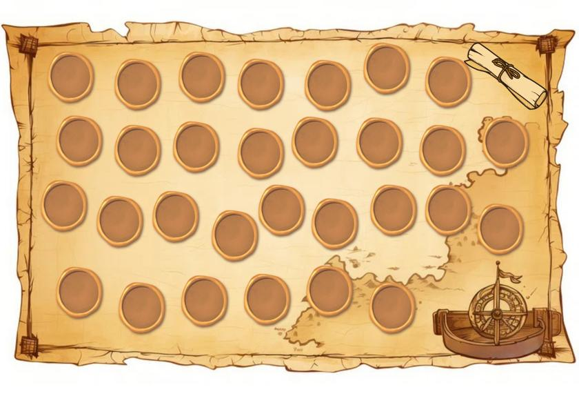

# Treasure Hunt: a dice-and-board game in Java Swing

A two-stage single-player board game. Enter a nickname in the menu, then start a game or open your scoreboard. You roll a die, move along a path of 30 tiles, and every tile hides a random event. Reaching the last tile finishes the stage and saves your score.

  
  

*(Artwork used by the game screens: the menu image and the 30-tile board.)*

## How it plays

| | Stage 1 | Stage 2 |
|---|---|---|
| Tile events | empty tile, +10 points, −10 points | the same, plus "move 3 tiles forward" and "move 2 tiles back" |
| Finish | reach tile 30 | reach tile 30 |

- Each stage generates a new random map of 30 tiles (`GameManager.haritaOlustur`).
- When a stage ends, the score is appended to `score.txt` as `name,levelN,score`. After stage 1 you can continue to stage 2.
- The scoreboard shows the scores of the current nickname, loaded into a binary search tree.

## Code structure

| File | Role |
|---|---|
| `GameManager` | game rules: dice, movement, tile events, score file |
| `MyLinkedList`, `MyNode` | the board, as a hand-written singly linked list |
| `BinarySearchTree`, `BSTNode` | the scoreboard, as a hand-written binary search tree |
| `AydinSandikciMenu`, `AydinSandikciNickName`, `AydinSandikciIlkEtap`, `AydinSandikciIkinciEtap`, `AydinSandikciScoreBoard` | Swing screens (NetBeans GUI Builder, `.form` files) |

`docs/Report.pdf` is a short project report (overview, game flow, data structures, challenges).

## Run it

Open the folder as a NetBeans project and run `AydinSandikciMenu` (the project already contains the `lib/` entries NetBeans expects), or compile with `javac -cp lib/absolutelayout/AbsoluteLayout.jar src/aydinsandikcimenu/*.java`. `score.txt` is created in the working directory and is git-ignored.

## Known issues

Found while reviewing the code for this README; nothing was changed.

- **A forward-move tile is applied twice:** in `GameManager.ileriGeriGit`, after moving forward the tile you land on is processed twice (`hazineAc()` is called inside the `if` and again after it), so its points or movement count double.
- Stepping back near the start can push the position counter below 1 (even to −1) while the token stays on the first tile.
- The score file is a plain text file in the working directory; there are no tests.

## Türkçe özet

İki aşamalı, tek oyunculu bir zar ve tahta oyunu (Java Swing). Takma ad girip oyuna başlarsınız, zar atarak 30 karelik yolda ilerlersiniz; kareler rastgele olaylar içerir (boş, +10 puan, −10 puan; ikinci aşamada ayrıca 3 ileri / 2 geri). Harita elle yazılmış bir bağlı liste ile, skor tablosu elle yazılmış bir ikili arama ağacı ile tutulur. Aşama bitince puan `score.txt` dosyasına eklenir. Bilinen sorunlar yukarıda listelenmiştir.
